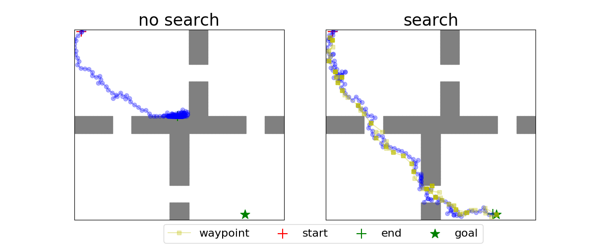
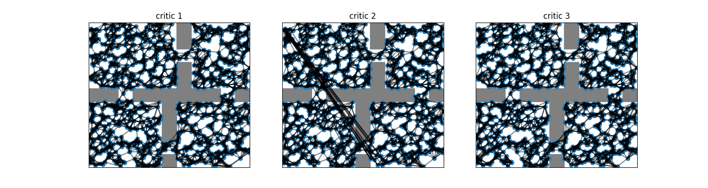

# Sparse Graphical Memory (SGM) and Search on the Replay Buffer (SoRB) in PyTorch

## Example usage
```
pip install -e .

python run_PointEnv.py
```

## SoRB planning visualization


## State graph visualization 

1. SoRB state graph


2. SGM state graph

## Credits
* https://github.com/scottemmons/sgm
* https://github.com/google-research/google-research/tree/master/sorb
* https://github.com/sfujim/TD3

## References
[1]: Michael Laskin, Scott Emmons, Ajay Jain, Thanard Kurutach, Pieter Abbeel, Deepak Pathak, ["Sparse Graphical Memory for Robust Planning"](https://arxiv.org/abs/2003.06417), 2020.

[2]: Benjamin Eysenbach, Ruslan Salakhutdinov, Sergey Levine, ["Search on the Replay Buffer: Bridging Planning and Reinforcement Learning"](https://arxiv.org/abs/1906.05253), 2019.
