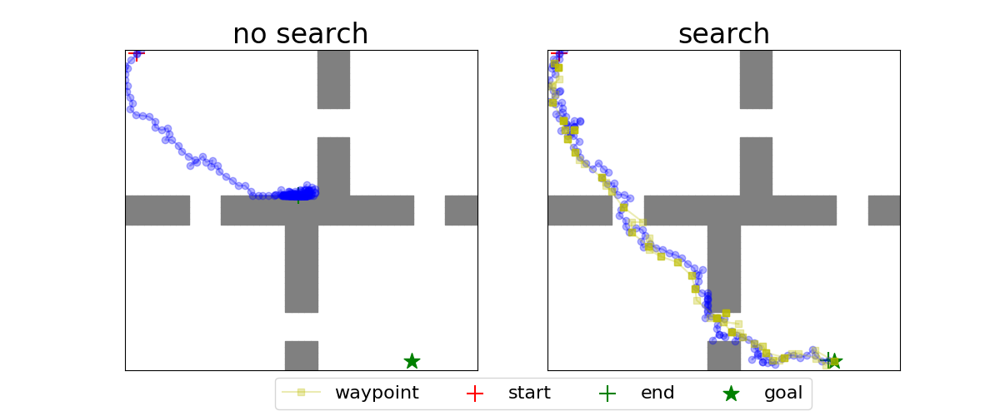
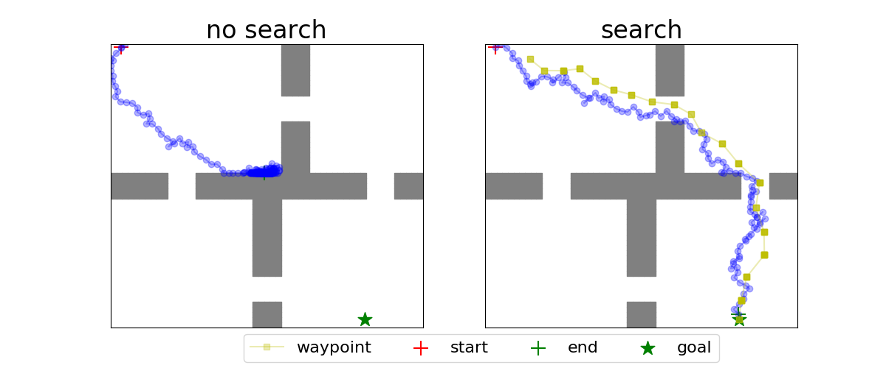
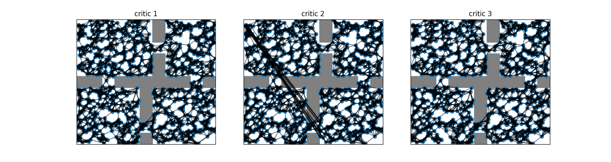
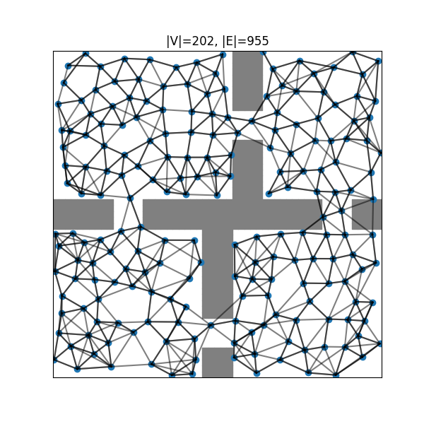

# Sparse Graphical Memory (SGM) and Search on the Replay Buffer (SoRB) in PyTorch

## Example usage
```
pip install -e .

python run_PointEnv.py
```

## Results

### SoRB (re-planning with closest waypoint) trajectory visualization


```
policy: no search
start: [0.03271197 0.99020872]
goal: [0.81310241 0.028764  ]
steps: 300
----------
policy: search
start: [0.03271197 0.99020872]
goal: [0.81310241 0.028764  ]
steps: 127
```

### SoRB (open loop planning) trajectory visualization


```
policy: no search
start: [0.03271197 0.99020872]
goal: [0.81310241 0.028764  ]
steps: 300
----------
policy: search
start: [0.03271197 0.99020872]
goal: [0.81310241 0.028764  ]
steps: 111
```

### State graph visualization 

1. SoRB state graph (per critic in ensemble)


2. SGM state graph (ensembled)
<!--  -->
<p align="center"></p>

```
Initial SparseSearchPolicy (|V|=202, |E|=1894) has success rate 0.20, evaluated in 88.82 seconds
Filtered SparseSearchPolicy (|V|=202, |E|=986) has success rate 0.80, evaluated in 44.53 seconds
Took 2500 cleanup steps in 119.46 seconds
Cleaned SparseSearchPolicy (|V|=202, |E|=973) has success rate 0.80, evaluated in 57.41 seconds
```

## Credits
* https://github.com/scottemmons/sgm
* https://github.com/google-research/google-research/tree/master/sorb
* https://github.com/sfujim/TD3

## References
[1]: Michael Laskin, Scott Emmons, Ajay Jain, Thanard Kurutach, Pieter Abbeel, Deepak Pathak, ["Sparse Graphical Memory for Robust Planning"](https://arxiv.org/abs/2003.06417), 2020.

[2]: Benjamin Eysenbach, Ruslan Salakhutdinov, Sergey Levine, ["Search on the Replay Buffer: Bridging Planning and Reinforcement Learning"](https://arxiv.org/abs/1906.05253), 2019.
